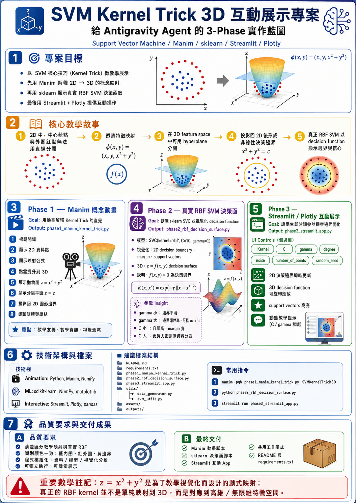

# SVM Kernel Trick 3D Interactive Demo

**Live Demo:** [svmdemo.streamlit.app](https://svmdemo.streamlit.app/)

> An educational project demonstrating how Support Vector Machines use kernel tricks to learn nonlinear decision boundaries. Built for high school and introductory ML students.



## Project Overview

Three integrated demos that progressively explain the SVM kernel trick concept:

| Phase | File | What It Does |
|-------|------|--------------|
| 1 | `phase1_manim_kernel_trick.py` | Manim animation: 2D data lifted to 3D via φ(x,y) = (x, y, x² + y²), showing a separating hyperplane |
| 2 | `phase2_rbf_decision_surface.py` | Real sklearn RBF SVM: 2D decision boundary + 3D decision function surface with support vectors |
| 3 | `phase3_streamlit_app.py` | Interactive Plotly dashboard: adjust kernel, C, gamma, noise in real time |

## Educational Story

1. "2D inner blue points and outer red points cannot be separated by a straight line."
2. "Through feature mapping, the data is lifted to 3D."
3. "In the 3D feature space, a hyperplane can separate the classes."
4. "The 3D hyperplane projects back to 2D as a nonlinear (circular) decision boundary."
5. "A real RBF SVM decision function surface shows how the kernel works in practice."
6. "An interactive interface lets students adjust C, gamma, and kernel to build intuition."

## Installation

```bash
pip install -r requirements.txt
```

> **Windows note:** `manim` depends on `moderngl` and `glcontext`, which require Visual C++ Build Tools. If `pip install manim` fails:
> - Install [Microsoft C++ Build Tools](https://visualstudio.microsoft.com/visual-cpp-build-tools/), or
> - Use conda: `conda install -c conda-forge manim`

## Run Commands

### Phase 1 — Manim Animation

```bash
manim -pql phase1_manim_kernel_trick.py SVMKernelTrick3D   # low-quality preview
manim -pqh phase1_manim_kernel_trick.py SVMKernelTrick3D   # high-quality render
```

### Phase 2 — RBF SVM Decision Surface

```bash
python phase2_rbf_decision_surface.py
```

Output images saved to `outputs/`.

### Phase 3 — Interactive Streamlit App

```bash
streamlit run phase3_streamlit_app.py
```

Or try it live at: https://svmdemo.streamlit.app/

## Screenshots

| 2D Decision Boundary | 3D Decision Function Surface |
|---|---|
|  |  |

## Parameter Guide

| Parameter | What It Does | Try This |
|-----------|-------------|----------|
| **Kernel** | Controls decision boundary shape | Switch to `linear` — fails on circular data |
| **C** | Regularization: trade-off between margin width and training errors | 0.1 (softer) vs 50 (harder) |
| **Gamma** | RBF kernel width: how far each support vector's influence reaches | 0.1 (smooth) vs 5 (overfit) |
| **Degree** | Polynomial kernel degree (poly only) | 2 (quadratic) vs 5 (complex) |
| **Noise** | Gaussian noise added to data points | 0 (perfect separation) vs 0.3 (messy) |

## Important Mathematical Note

The mapping z = x² + y² in Phase 1 is a visual and educational feature mapping used to explain why nonlinear data can become linearly separable in a higher-dimensional feature space. A real RBF kernel does **not** explicitly map data to only 3D; it corresponds to a high-dimensional or infinite-dimensional feature space. The Phase 2 and Phase 3 visualizations show the decision function f(x, y), not the full feature space itself.

## Teaching Suggestions

- Start with the Manim animation to build conceptual intuition.
- Use Phase 3 with **linear kernel** to show it fails — reinforcing *why* kernels are needed.
- Experiment: gamma = 0.1 (smooth, high bias) vs gamma = 5 (wiggly, overfitting).
- Experiment: C = 0.1 (wide margin, some mistakes ok) vs C = 50 (narrow margin, tries harder).
- Discuss how gamma controls the "reach" of each support vector and C trades off margin width vs training errors.

## Repository Structure

```
.
├── README.md
├── requirements.txt
├── .gitignore
├── phase1_manim_kernel_trick.py    # Manim 3D animation
├── phase2_rbf_decision_surface.py  # sklearn RBF SVM plots
├── phase3_streamlit_app.py         # Streamlit + Plotly interactive app
├── utils/
│   ├── data_generator.py           # Ring dataset generator
│   └── svm_utils.py               # SVM training & decision grid helpers
├── assets/                         # Static assets (empty)
└── outputs/                        # Generated plots (gitignored)
```
